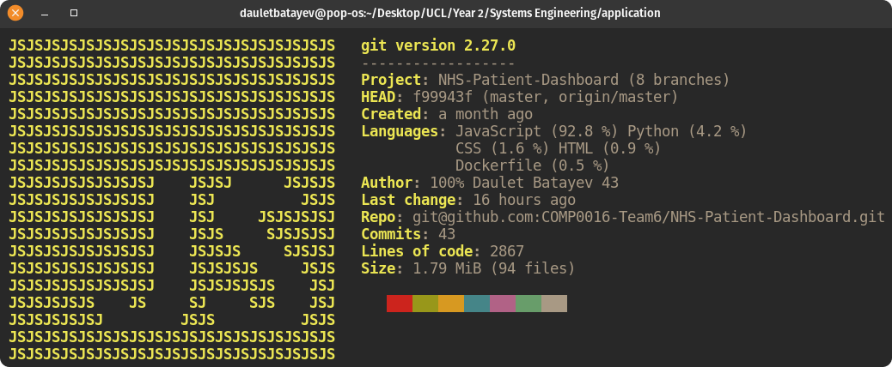

# Dashboard for visualising patients’ infusion pump feed data (UCL x GOSH).



<br />

### The application is deployed at [dauletbatayev.com](https://dauletbatayev.com/) for demonstration purposes.

### The user manual can be found [here](https://comp0016-team6.github.io/user-manual/).

<br />

## Contents
---

* ### [Project Description and Team Members](#project-description-and-team-members)
* ### [Getting Started](#getting-started)
  * ### [Local Deployment](#running-the-app-locally) 
  * ### [Deployment on a Ubuntu Server (AWS, Digital Ocean, etc.)](#deploying-the-application-on-ubuntu-vps-(aws,-digital-ocean-and-etc.))
* ### [Testing](#testing)
* ### [Contacts](#contacts)


## Project Description and Team Members
---

The project was developed by **Team 6**, as a part of **UCL COMP0016**, for the **Great Ormond’s Saint Hospital (GOSH) NHS** and aims to provide the following and more:

- User-friendly, data-rich dashboard for visualising the infusion pump feed data of the patients, who are undergoing treatment at either a hospital or at home.

- Secure and reliable authentication system using JWT for both clinicians and the patients.

- The ability to change patients’ treatment plans and viewing the treatment history.

- The feedback system for both patients and clinicians to explain any abnormalities in the received feed.

- Data filtering tools: filter by date range, show feed by day, by month and by year.


The demonstration video can be accessed here: "link".


**Team members: Daulet Batayev, Henry Ching, Tianang Chen - all second-year Computer Science students at UCL.**


## Getting Started
---


## Running the App Locally

### Prerequisites:
* git
* npm or yarn

<br />

### 1. General Installation

```
$ git clone https://github.com/COMP0016-Team6/NHS-Patient-Dashboard.git
$ cd server
$ npm install
$ cd ../server
$ npm install
```
<br />

### 2. Install and Configure PostgreSQL

```
$ sudo apt update && sudo apt upgrade -y
$ sudo apt install postgresql postgresql-contrib -y
```

Create a new user:

```
$ sudo -i -u postgres
$ createuser --interactive
Enter name of role to add: <YOUR USER NAME>
Shall the new role be a superuser? (y/n) y
```

Exit out of the `postgres` user by running `exit` on the command line.
Run `psql -d postgres` as the current user and add a password:

```
postgres=# ALTER USER <YOUR USER NAME> PASSWORD 'password';
```

Create a database called `application`:

```
$ psql -d application
postgres=# create database application;
```

To create the schema run:

```
psql -h localhost -d application -U <YOUR USER NAME> -f “PATH_TO_CLONED_DIR/server/database.sql”
```
<br />

### 3. Setting Environment Variables

Navigate to the server directory and create a `.env` file and populate it as follows:

```
jwtSecret= <YOUR SECRET FOR JWT>

PORT=5000

PGHOST=localhost
PGUSER=<YOUR Postgres USER NAME>
PGPASSWORD=<YOUR Postgres USER PASSWORD>
PGDATABASE=application
PGPORT=5432

ADMINPASSWORD=<PASSWORD YOU WISH TO USE FOR ADMIN OF THE APP>
```

Now we can start both the server and the client.

To start the server run `npm run dev` from the server directory and run `npm start` from the client directory to start the client.


Now you can navigate to [http://localhost:3000/](http://localhost:3000/) on your browser and login as an admin (**admin@admin.com**) and using your password set in `.env`. 

Admin can register new clinicians and patients.


Once you have at least one patient registered, you can simulate the infusion pump by setting up the *cronjob* to run `genFeeds.py` every 20-30 mins.

But first, make sure you run `pip install -r requirements.txt` from the server directory.

You can now setup your *cronjob* as follows. Run `crontab -e` and add the following line at the bottom to run the script every 30 minutes:

```*/30 * * * * /usr/bin/python3 <YOUR FULL PATH>/server/genFeeds.py```


Alternatively, if you want to view all the functionality of the app by populating the patients with their feeds and weights, you can do so without a cronjob. Simply run:

```
$ python3 simulationData.py
$ python3 genWeights.py
```

<br />

## Deploying the Application on Ubuntu VPS (AWS, Digital Ocean and etc.)

### 1. Startup

After you ssh to the VPS, follow all the [steps above](#running-the-app-locally). However, create the `.env` file outside of your application directory (you can optionally add `NODE_ENV=production` environment variable). Once `.env` file is populated, add the following line to the bottom of `/home/<USER NAME>/.profile` file:

`set -o allexports; source <path_to_env>/.env; set +o allexport`

This makes sure that the environment variables persist.

Next, you need to install [pm2](https://pm2.keymetrics.io/), by running `sudo npm install pm2 -g`.

To start [pm2](https://pm2.keymetrics.io/), run `pm2 start <path_to_server>/server/index.js --name nhs-dashboard`.

Configure [pm2](https://pm2.keymetrics.io/) to automatically startup the process after a reboot, run `pm2 startup` and copy the `sudo env PATH=...` line and paste and run it in the terminal. Finally run `pm2 save`.

<br />

### 2. Build the react app

Navigate to the client, and run `npm run build`.

<br />

### 3. Install and configure Nginx

```
sudo apt install nginx -y
sudo systemctl enable nginx
```

Navigate to `/etc/nginx/sites-available`.

Create a file with the name of your domain. ``sudo cp default <your domain name>``, in my case it would be ``sudo cp default dauletbatayev.com``.

Open the file we just created and modify it so it looks like this:

```
server {
  listen 80;
  listen [::]:80;

  root <PATH TO CLIENT>/client/build;

  index index.html index.htm index.nginx-debian.html;

  server_name <your domain name> www.<your domain name>;

  location / {
    try_files $uri /index.html;
  }

  location /api {
    proxy_pass http://localhost:5000;
    proxy_http_version 1.1;
    proxy_set_header Upgrade $http_upgrade;
    proxy_set_header Connection 'upgrade';
    proxy_set_header Host $host;
    proxy_cache_bypass $http_upgrade;
  }
}
```

Enable the new site

```
$ sudo ln -s /etc/nginx/sites-available/<the new file> /etc/nginx/sites-enabled/

$ systemctl restart nginx
```

**Congratulations, your application is deployed and can be accessed at the domain name you have set.**

<br />

## Testing
---

The repository contains **unit tests**, **backend integration tests**, **snapshot tests**, and **end-to-end tests**. Always run the tests locally and never in production.

Tests are expected to be run in the following order: backend tests, frontend test, and e2e tests.

You have to create a new database for testing and modify the local environment variables to “point” to the testing database.

```
# .env
jwtSecret=

PORT=5000

PGHOST=localhost
PGUSER=
PGPASSWORD=
PGDATABASE=test
PGPORT=5432

ADMINPASSWORD=
```

Every time before running the tests, you must run ``psql -h localhost -d test -U <USER NAME> -f "<PATH TO SERVER>/server/test/setup/cleanup.sql`` to clean up the database.


Before running the tests, modify *line 7* in `package.json` on the server side to your own path.

Startup your backend in another terminal window by running `npm run dev` or `npm run coverage` and run the tests in another window `npm test -- --runInBand --detectOpenHandles`.

If tests are not passing, it is most likely you haven’t started the server.

To run the frontend snapshot tests, navigate to the client directory and simply run `npm run`.

Make sure you update the snapshots every time you change the React Component.

Before running the tests, make sure you have `cypress` installed. Then, create the cypress.json file with the following contents:

```
{
  “env”: {
    “adminPassword”: <THE ADMIN PASSWORD YOU CAME UP WITH> 
  },
  “testFiles”: [
    “register.spec.js”,
    “login.spec.js”,
    “patientDashboard.spec.js”,
    “clinicianDashboard.spec.js”
  ]
}
```

To run the tests, you also need to start the local client (`npm start`) in another tab alongside running the server.

Finally run `npm run e2e` for end-to-end testing.

<br />

## Contacts
---

**If you are working on further development of the project, please feel free to contact me at daulet.batayev@gmail.com or daulet.batayev.19@ucl.ac.uk**